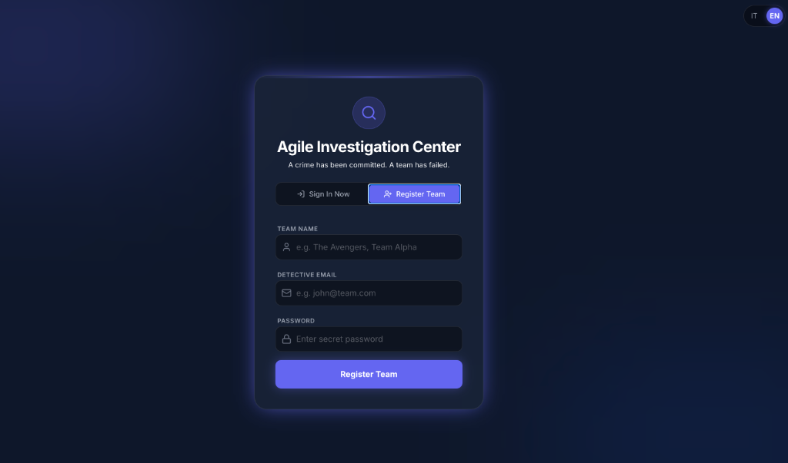
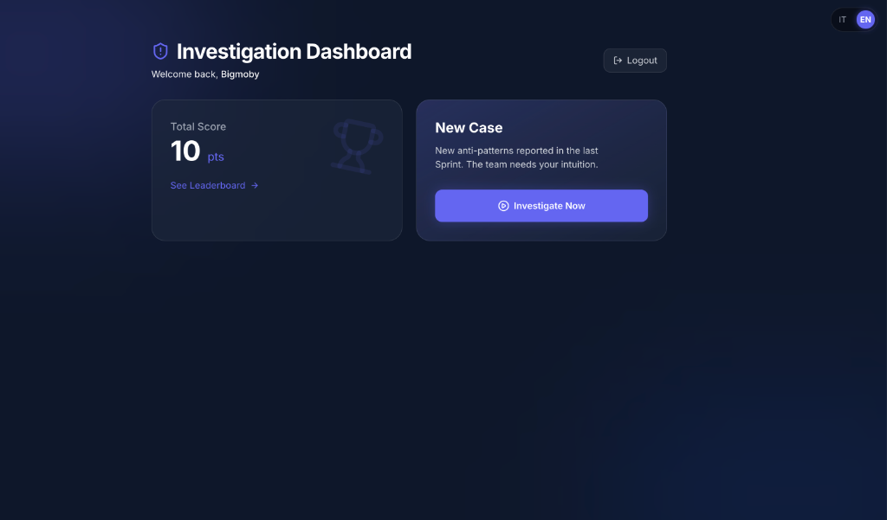
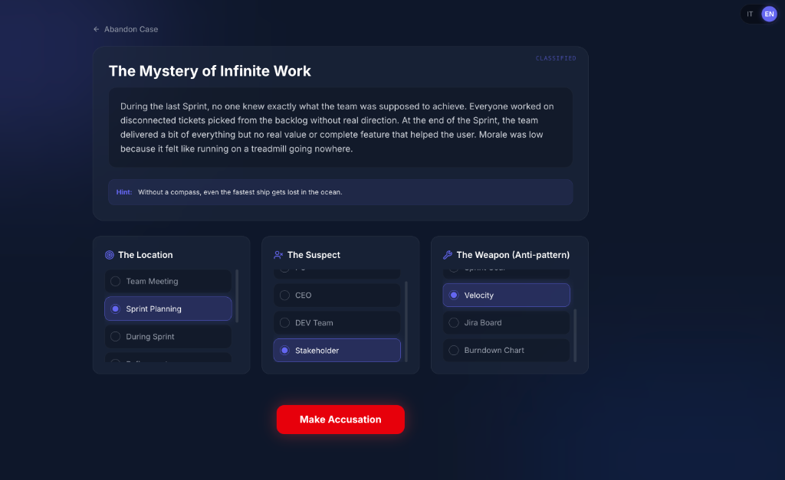
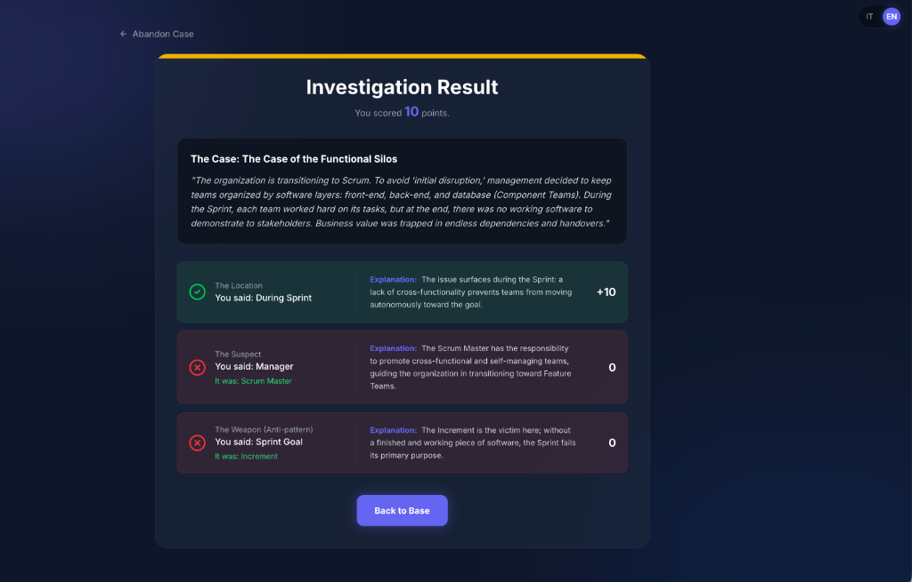
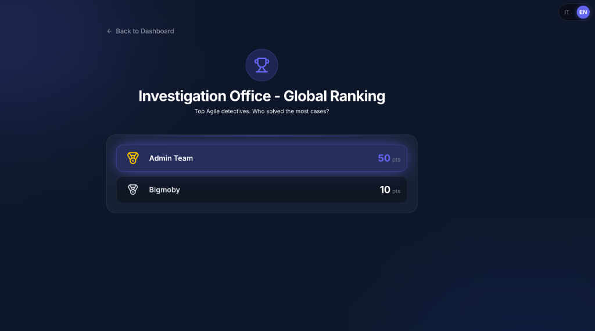
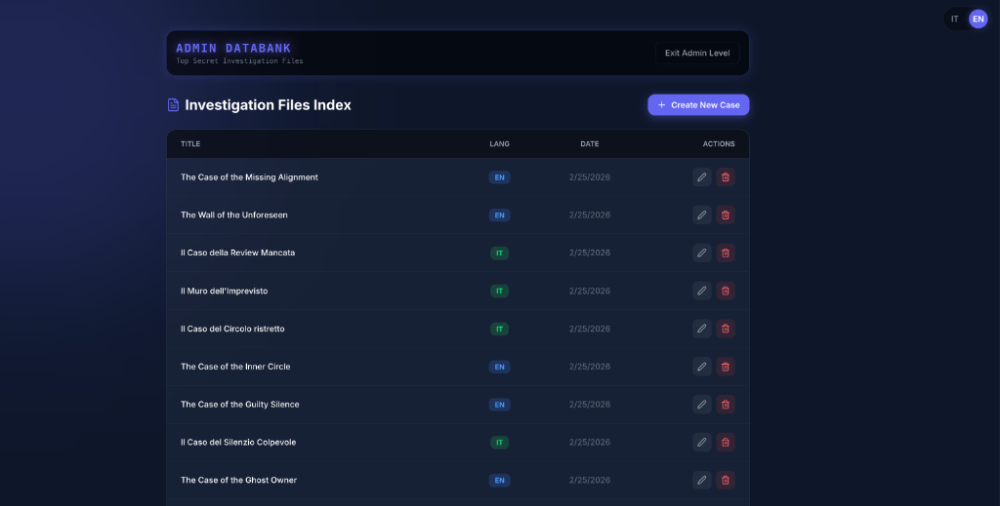

# Scrum Training App

A gamified training tool for Agile Coaches and Scrum Masters. Investigate anti-patterns, solve cold cases, and master the Scrum framework.

> **Note**: This project was built as an open-source tribute and recreation of the brilliant game [Murder in the Sprint](https://murderinthesprint.com/) created by Angelo Sala and Marco D'Andrea. This clone was built to allow the community to customize and expand upon their great idea.

---

### 📸 Screenshots

#### 🎮 Gameplay

<p align="center">
  
  <br/><br/>
  
  <br/><br/>
  
  <br/><br/>
  
  <br/><br/>
  
</p>

#### 🔒 Admin Panel

<p align="center">
  
  <br/><br/>
  
</p>

---

## Getting Started

First, install the dependencies if you haven't already:

```bash
npm install
```

Then, generate the Prisma client and seed the database with the investigation cases:

```bash
npx prisma generate
npx prisma db seed
```

Finally, run the development server:

```bash
npm run dev
# or
yarn dev
```

Open [http://localhost:3000](http://localhost:3000) with your browser to see the result.

## 🛡️ Admin Panel

The game includes a protected Administration Panel to manage (create, edit, delete) the investigation cases.

### How to access the Admin Panel:

1. Make sure you have run the database seed (`npx prisma db seed`).
2. Go to the game's homepage and click **"Login"** (or "Accedi").
3. Use the following default admin credentials:
   - **Team Name:** `Admin Team`
   - **Password:** `admin123`
4. Once logged in, you will see a red **"Admin Panel"** button in the top navigation bar of the Dashboard.
5. Click it to enter the **Admin Databank**, where you can modify the game's Content Management System.

## ✉️ Email Sending (Nodemailer and Ethereal)

The project is currently configured for development and fast prototyping. When a team registers or requests a password reset, the email **does not go to the user's real inbox**, but is "trapped" and sent via **Ethereal**.

Ethereal is a testing service for Nodemailer (the library we use to send emails) that simulates sending and gives you a link in the terminal to visually preview the email as if it had arrived, without spamming or requiring complex/paid configurations.

### How to switch to "Real" emails in Production?

To send real emails to users, you will need to replace the _Ethereal_ account with the SMTP credentials of a real provider (e.g., Gmail, SendGrid, Amazon SES).
To do this:

1. Open `src/app/api/auth/signup/route.ts` and `src/app/api/auth/forgot-password/route.ts`.
2. Look for the `nodemailer.createTransport({...})` configuration section.
3. Replace the `host: 'smtp.ethereal.email'` and the `auth: { user, pass }` strings with your **real SMTP credentials** saved as environment variables in the `.env` file (e.g., `user: process.env.SMTP_USER`).

## 🗄️ Database Management (Prisma)

The project uses **Prisma** with a local **SQLite** database (`prisma/dev.db`).

### Clearing the database (Reset)

If you want to delete all registered teams and start from scratch during testing, you have two main options:

**Option 1: Graphical Interface (Recommended)**

1. Open a **new** terminal in the project folder (leaving the Next.js server running in another one).
2. Run the command: `npx prisma studio`
3. A local service will start and open a page in your browser at `http://localhost:5555`. **Important:** For the page to work, you must leave the terminal window open and the command running!
4. From there, you can navigate the tables (`Team`, `PlaySession`) and visually delete the records you want.
5. When you are done cleaning up, go back to the Prisma Studio terminal and press `CTRL + C` to stop it.

**Option 2: Terminal (Total Reset)**

If you want to wipe everything and restore only the game Cases and the Admin Team contained in the original seed file:

1. Open a terminal in the project folder.
2. Run the command: `npx prisma migrate reset`
3. Confirm with `y` (Yes).
4. This command will drop the entire database, recreate it empty, and automatically run the `seed.ts` file, repopulating the initial setup.
